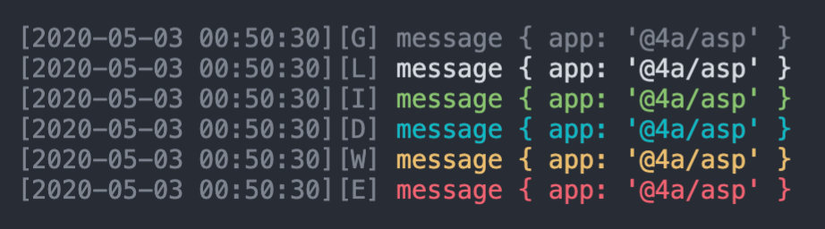

asp
---
染色日志，推荐配合iTerm使用，非标准日志模块，方便日志聚焦

### Install
```sh
npm i @4a/asp
```

### Usage
```js
const asp = require('@4a/asp')

asp.gray('message', { app: '@4a/asp' })
asp.log('message', { app: '@4a/asp' })
asp.info('message', { app: '@4a/asp' })
asp.debug('message', { app: '@4a/asp' })
asp.warn('message', { app: '@4a/asp' })
asp.error('message', { app: '@4a/asp' })
```

### Preview



### class Asp
```js
const Asp = require('@4a/asp').Asp

// 开启日志类型标记，默认关闭
const asp = new Asp(true)
```


### Level
分级显示
```sh
level=0 node app.js # only error
level=1 node app.js # warn, error
level=2 node app.js # debug, warn, error
level=3 node app.js # info, debug, warn, error
level=4 node app.js # log, info, debug, warn, error
level=5 node app.js # all
```
level
```js
{
    error: 0,
    warn: 1,
    debug: 2,
    info: 3,
    log: 4,
    gray: 5,
}
```

### Example
```sh
node demo.js
```
